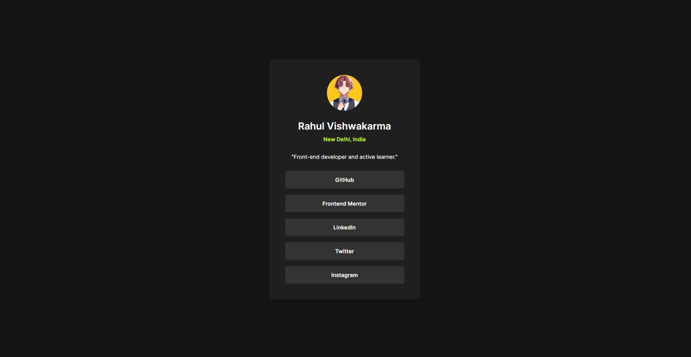

# Frontend Mentor - Social links profile solution

This is my solution to the [Social links profile challenge on Frontend Mentor](https://www.frontendmentor.io/challenges/social-links-profile-UG32l9m6dQ). 

## Table of contents

- [Overview](#overview)
  - [The challenge](#the-challenge)
  - [Screenshot](#screenshot)
  - [Links](#links)
- [My process](#my-process)
  - [Built with](#built-with)

## Overview

### The challenge

Users should be able to:

- See hover and focus states for all interactive elements on the page

### Screenshot

### Links

- Solution URL: ([Here](https://github.com/rahulkumar215/Social-Links-Profile))
- Live Site URL: ([Here](https://rahulkumar215.github.io/Social-Links-Profile/))

## My process

### Built with

- Semantic HTML5 markup
- CSS custom properties
- Flexbox
